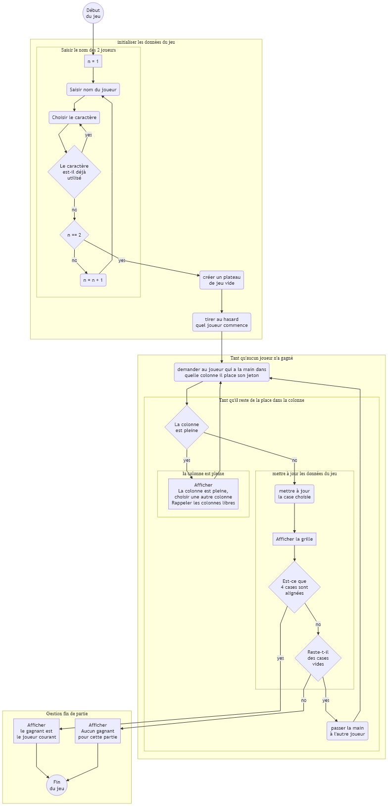

# Projet JAVA Puissance 4

- [Description du jeu](#description-du-jeu)
- [Description de l'implémentation technique](#description-de-l'implémentation-technique)
  - [Algorithme du jeu](#algorithme-du-jeu)
- [La notice d'utilisation](#la-notice-d'utilisation)

  
## Description du jeu

Ce jeu se joue à deux joueurs sur une grille de hauteur 6 et de largeur 7 (voir par exemple https://fr.wikipedia.org/wiki/Puissance₄). Les joueurs laissent tomber chacun leur tour un jeton dans une colonne. Lorsqu’un joueur aligne 4 jetons de sa couleur (en ligne ou en diagonale), il a gagné. Il peut arriver qu’aucun joueur ne parvienne à aligner 4 jetons, donnant lieu à un match nul.

La grille de jeu pourra être modélisée par un tableau de 6 lignes par 7 colonnes. Chaque case du tableau pouvant contenir l’information : 
- case vide, 
- case occupée par un jeton d’un joueur, 
- case occupée par un jeton de l’autre joueur. 

Il faut choisir un type pour les éléments du tableau (char, int, String, …) et un codage permettant de représenter ces informations (comment représenter une case vide par exemple?).

## Description de l'implémentation technique

### Algorithme du jeu

 

### Modélisation des classes

## La notice d'utilisation

