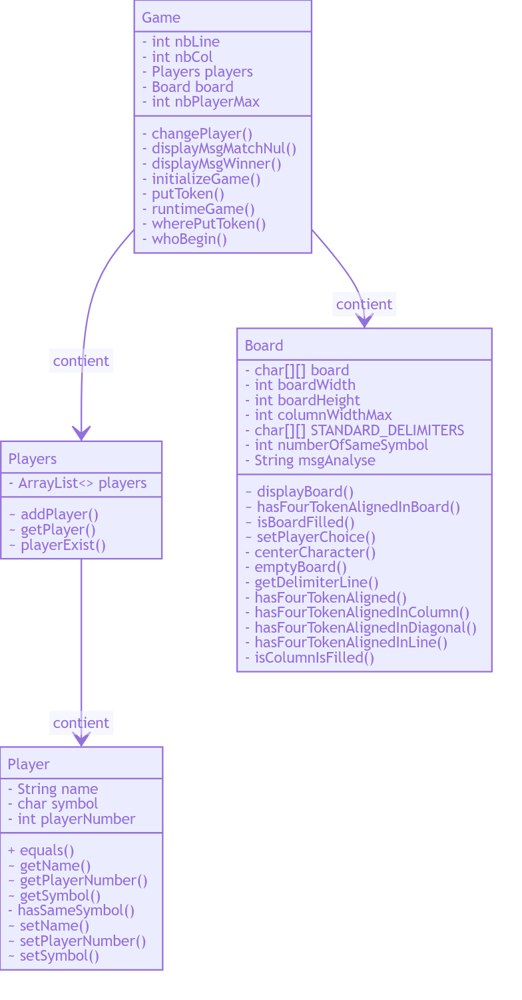

# Projet JAVA Puissance 4

- [Description du jeu](#description-du-jeu)
- [Description de l'implémentation technique](#description-de-l'implémentation-technique)
  - [Algorithme du jeu](#algorithme-du-jeu)
  - [Modélisation des classes](#modélisation-des-classes)
- [La notice d'utilisation](#la-notice-d'utilisation)
  - [Installation](#installation)
    - [Pré requis](#pré-requis)
  - [Execution](#execution)
    - [Via IntelliJ](#via-intelliJ)
      - [Execution du programme principal](#execution-du-programme-principal)

## Description du jeu

Ce jeu se joue à deux joueurs sur une grille de hauteur 6 et de largeur 7 (voir par exemple <https://fr.wikipedia.org/wiki/Puissance_4>). Les joueurs laissent tomber chacun leur tour un jeton dans une colonne. Lorsqu’un joueur aligne 4 jetons de sa couleur (en ligne ou en diagonale), il a gagné. Il peut arriver qu’aucun joueur ne parvienne à aligner 4 jetons, donnant lieu à un match nul.

La grille de jeu pourra être modélisée par un tableau de 6 lignes par 7 colonnes. Chaque case du tableau pouvant contenir l’information :

- case vide,
- case occupée par un jeton d’un joueur,
- case occupée par un jeton de l’autre joueur.

Il faut choisir un type pour les éléments du tableau (char, int, String, …) et un codage permettant de représenter ces informations (comment représenter une case vide par exemple?).

## Description de l'implémentation technique

### Algorithme du jeu

<p align="center">
 
</p>

### Modélisation des classes

<p align="center">
 
</p>

## La notice d'utilisation

### Installation

#### Pré requis

Logiciels necessaires :

- Git **v2.21.0** ou supérieure
  - ([Installation](https://git-scm.com/downloads))
- JDK Java **v11** ou supérieure
  - ([Installation sur Linux](https://docs.oracle.com/en/java/javase/11/install/installation-jdk-linux-platforms.html#GUID-737A84E4-2EFF-4D38-8E60-3E29D1B884B8))
  - ([Installation sur Windows](https://docs.oracle.com/en/java/javase/11/install/installation-jdk-microsoft-windows-platforms.html#GUID-A7E27B90-A28D-4237-9383-A58B416071CA))
  - ([Installation sur MacOs](https://docs.oracle.com/en/java/javase/11/install/installation-jdk-macos.html#GUID-2FE451B0-9572-4E38-A1A5-568B77B146DE))

Dans un répertoire vide dénommé dans la suite **\<repertoire\>**, executer la commande suivante :

```git
git clone https://github.com/SylvainSimplonGit/java-project-power4.git
```

Cette commande fera une copie de ce repository sur votre poste local.

### Execution

#### Via IntelliJ

##### Execution du programme principal

- Sélectionnez dans le menu d'IntelliJ, ***Run*** puis le sous menu ***Edit Configurations...***

- Dans ***Main Class*** choisir *Main*

- Ensuite amusez-vous !
